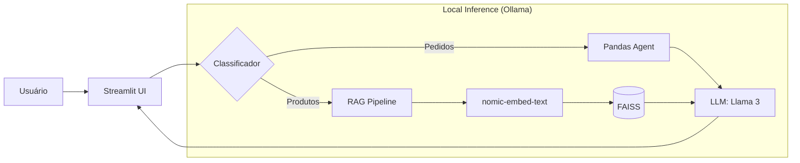

Arquitetura para **Local (Ollama)**, o README precisa ser totalmente reescrito para refletir os novos pré-requisitos (instalação do Ollama, download de modelos) e a eliminação da dependência da OpenAI.

Aqui está o **README.md** definitivo para a versão "Local LLM Edition" da sua POC.

---

# 🦙 E-commerce Intelligent Chatbot (Local LLM Edition)


## 📋 Visão Geral Executiva

Esta Prova de Conceito (POC) demonstra uma solução de **IA Generativa Híbrida** rodando 100% localmente. O projeto resolve o desafio de custos de API e privacidade de dados, utilizando modelos open-source (Llama 3) para atender clientes de e-commerce.

A arquitetura implementa um sistema de **Roteamento Inteligente** que diferencia:
1.  **Busca Semântica (RAG):** Para recomendação e descrição de produtos (Dados Não-Estruturados).
2.  **Análise de Dados (Agentes):** Para consulta de status de pedidos e prazos (Dados Estruturados).

---

## 🏗️ Arquitetura da Solução

O sistema elimina a dependência de nuvem (OpenAI) substituindo-a pelo runtime local **Ollama**.



---

## 💻 Pré-requisitos de Hardware

Como a IA roda na sua máquina, recomenda-se:
*   **RAM:** Mínimo 8GB (16GB Recomendado).
*   **Processador:** Recente (Intel i5/i7, AMD Ryzen ou Apple Silicon M1/M2/M3).
*   **Espaço em Disco:** ~6GB livres (para os modelos).

---

## 🚀 Guia de Instalação Passo-a-Passo

### Passo 1: Configurar o Ollama (O "Cérebro" Local)

1.  Baixe e instale o **Ollama** em [ollama.com](https://ollama.com).
2.  Após instalar, abra seu terminal (PowerShell ou CMD) e baixe os modelos necessários:

    ```bash
    # Baixa o modelo de linguagem (LLM) - ~4.7GB
    ollama pull llama3

    # Baixa o modelo de embeddings (para o RAG) - Leve
    ollama pull nomic-embed-text
    ```
3.  **Verifique se está rodando:** Mantenha o aplicativo Ollama aberto (ícone na barra de tarefas).

### Passo 2: Clonar e Preparar o Projeto

1.  Clone este repositório:
    ```bash
    git clone https://github.com/seu-usuario/ecommerce-chatbot-local.git
    cd ecommerce-chatbot-local
    ```

2.  (Opcional) Crie um ambiente virtual:
    ```bash
    python -m venv venv
    # Windows:
    .\venv\Scripts\activate
    # Linux/Mac:
    source venv/bin/activate
    ```

### Passo 3: Instalar Dependências Python

Instale as bibliotecas necessárias (versões fixadas para estabilidade):

```bash
pip install -r requirements.txt
```

### Passo 4: Executar a Aplicação

```bash
streamlit run app.py
```

---

## 🧪 Como Testar

A interface abrirá no seu navegador. Tente as seguintes interações para testar os dois "lados" do cérebro da IA:

### 1. Teste de Produtos (Usa RAG + Vector Store)
*O modelo busca no catálogo por similaridade.*
*   *"Estou procurando um tênis para correr maratonas."*
*   *"Você tem algum fone que cancela barulho?"*
*   *"Me recomende uma cadeira para trabalhar o dia todo."*

### 2. Teste de Pedidos (Usa Agente + Pandas)
*O modelo lê a tabela, filtra dados e calcula datas.*
*   *"Qual o status do pedido 5005?"*
*   *"Quantos pedidos foram cancelados?"*
*   *"O pedido do cliente 3 já foi entregue?"*

---

## 📂 Estrutura do Código

```text
ecommerce-chatbot-local/
│
├── app.py                 # Interface Principal (Streamlit)
├── requirements.txt       # Lista de dependências
│
└── src/
    ├── data_generator.py  # Gera dados sintéticos (Produtos/Pedidos)
    ├── rag_engine.py      # Configuração do RAG com OllamaEmbeddings
    ├── agent_engine.py    # Configuração do Agente com ChatOllama
    └── router.py          # Lógica de decisão (If/Else Keywords)
```

---

## ⚠️ Troubleshooting (Problemas Comuns)

**Erro: "Connection refused" ou falha ao conectar**
*   **Causa:** O Ollama não está rodando.
*   **Solução:** Abra o aplicativo Ollama no seu computador ou rode `ollama serve` no terminal.

**Erro: "Model not found"**
*   **Causa:** Você esqueceu de baixar os modelos.
*   **Solução:** Rode `ollama pull llama3` e `ollama pull nomic-embed-text`.

**Lentidão na resposta**
*   **Causa:** Rodar LLMs localmente exige CPU/GPU.
*   **Obs:** A primeira pergunta pode demorar mais pois o sistema está carregando o modelo na memória RAM.

---

### Chatbot POC


---

## 👨‍💻 Autor

**Kleber Augusto**
*Applied AI Engineer*

---
*Projeto desenvolvido como POC para demonstrar viabilidade de IA Generativa Local (Privacy-First).*