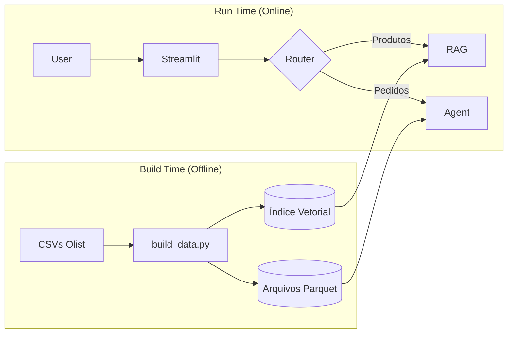
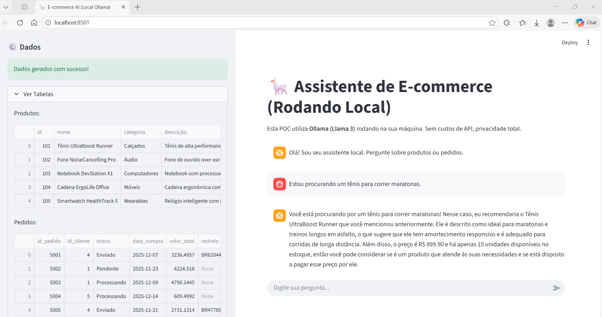
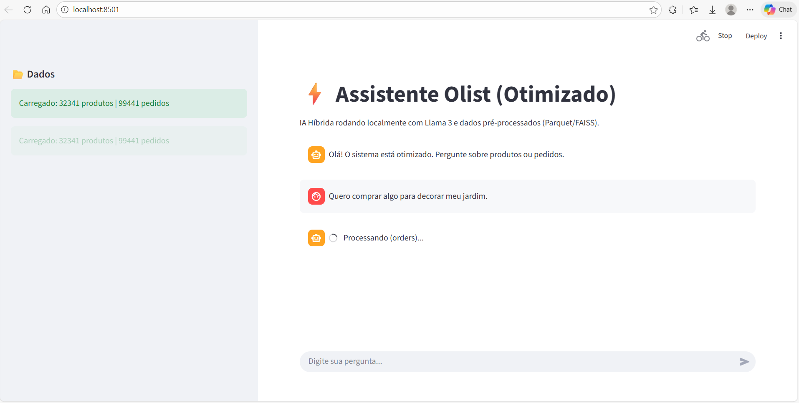
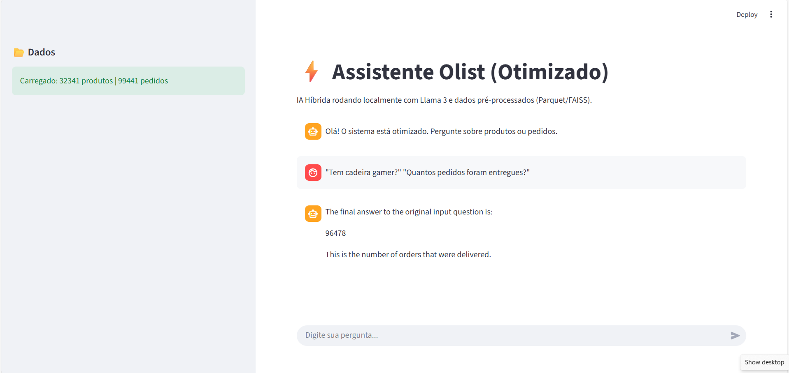
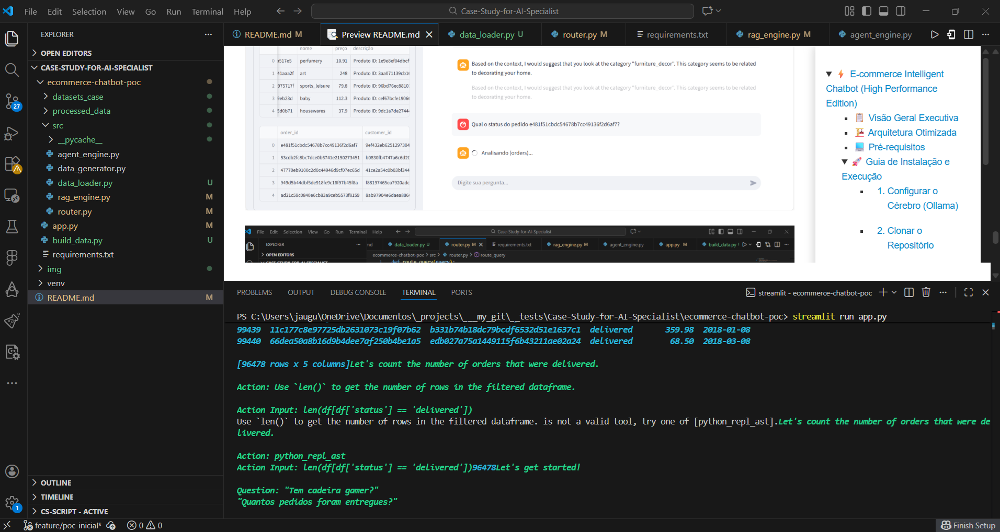

Entendido, vou preparar um README completo e renovado. Ele incluirá todas as seções importantes e informações relevantes. O novo README será claro, conciso e informativo.


Entendido, vou preparar um README completo e renovado. Ele incluirá todas as seções importantes e informações relevantes. O novo README será claro, conciso e informativo.


Entendido! Vou refazer o README completo, garantindo que todas as informações estejam claras e organizadas. Prepararei uma versão detalhada e fácil de seguir.


Aqui está o **README.md** final e definitivo, atualizado para refletir a arquitetura de **Alta Performance** (Parquet + FAISS Local) e o uso do **Olist Dataset**.

Este documento está pronto para ser o "cartão de visitas" do seu projeto no GitHub.

---

# ⚡ E-commerce Intelligent Chatbot (High Performance Edition)


## 📋 Visão Geral Executiva

Esta Prova de Conceito (POC) demonstra uma solução de **IA Generativa Híbrida** de alta performance aplicada ao dataset real da **Olist**. O sistema roda 100% localmente com latência mínima, graças a uma arquitetura de pré-processamento de dados.

A solução resolve o problema de lentidão em LLMs locais utilizando:
1.  **Persistência Vetorial:** Índice FAISS pré-calculado (sem vetorização em tempo real).
2.  **Dados Otimizados:** Leitura de arquivos Parquet (binário) em vez de CSV.
3.  **Roteamento Híbrido:**
    *   **RAG (Busca Semântica):** Para recomendação de produtos.
    *   **Agente Pandas:** Para análise estatística de pedidos.

---

## 🏗️ Arquitetura Otimizada



---

## 💻 Pré-requisitos

*   **Hardware:** Mínimo 8GB RAM (16GB Recomendado).
*   **Software:** Python 3.10+, Git e [Ollama](https://ollama.com).

---

## 🚀 Guia de Instalação e Execução

### 1. Configurar o Cérebro (Ollama)
Baixe o Ollama e execute no terminal:
```bash
ollama pull llama3
ollama pull nomic-embed-text
```

### 2. Clonar o Repositório
```bash
git clone https://github.com/seu-usuario/ecommerce-chatbot-olist.git
cd ecommerce-chatbot-olist
```

### 3. Preparar os Dados (ETL)
1.  Crie uma pasta `datasets_case` na raiz.
2.  Baixe o [Dataset da Olist](https://www.kaggle.com/datasets/olistbr/brazilian-ecommerce) e extraia os CSVs lá.
3.  Instale as dependências:
    ```bash
    pip install -r requirements.txt
    ```
4.  **Execute o script de build (Apenas uma vez):**
    *Este passo converte os CSVs gigantes em Parquet e cria o índice neural.*
    ```bash
    python build_data.py
    ```

### 4. Executar a Aplicação
```bash
streamlit run app.py
```

---

## 🧪 Casos de Teste (Performance)

### 🛍️ RAG (Produtos) - *Resposta Rápida*
*   *"Me indique um relógio barato."*
*   *"Quero comprar algo para decorar meu jardim."*
*   *"Qual o preço médio dos perfumes?"*

### 📦 Agente (Pedidos) - *Análise Precisa*
*   *"Qual o status do pedido `e481f51cbdc54678b7cc49136f2d6af7`?"*
*   *"Quantos pedidos foram cancelados?"*
*   *"Qual a soma total de todos os pedidos?"*

---

## 📂 Estrutura do Projeto

```text
ecommerce-chatbot-olist/
│
├── app.py                 # Interface Otimizada
├── build_data.py          # Script de ETL (CSV -> Parquet/FAISS)
├── processed_data/        # Dados binários gerados (GitIgnore)
├── datasets_case/         # Dados brutos (GitIgnore)
│
└── src/
    ├── data_loader.py     # Carregador de Parquet
    ├── rag_engine.py      # Carregador de FAISS
    ├── agent_engine.py    # Agente Pandas
    └── router.py          # Classificador de Intenção
```

---

---

## ⚠️ Notas Técnicas
*   **Performance:** Para garantir fluidez em máquinas locais, o `data_loader.py` limita o carregamento a uma amostra dos dados (1000 produtos / 5000 pedidos). Para usar o dataset completo, remova os `.head()` no código.
*   **Primeira Execução:** A primeira pergunta pode demorar alguns segundos enquanto o modelo é carregado na memória RAM.

---

### Chatbot POC









---

## 👨‍💻 Autor

**Kleber Augusto**
*Applied AI Engineer*

---

*Projeto desenvolvido como POC para demonstrar viabilidade de IA Generativa Local (Privacy-First).*